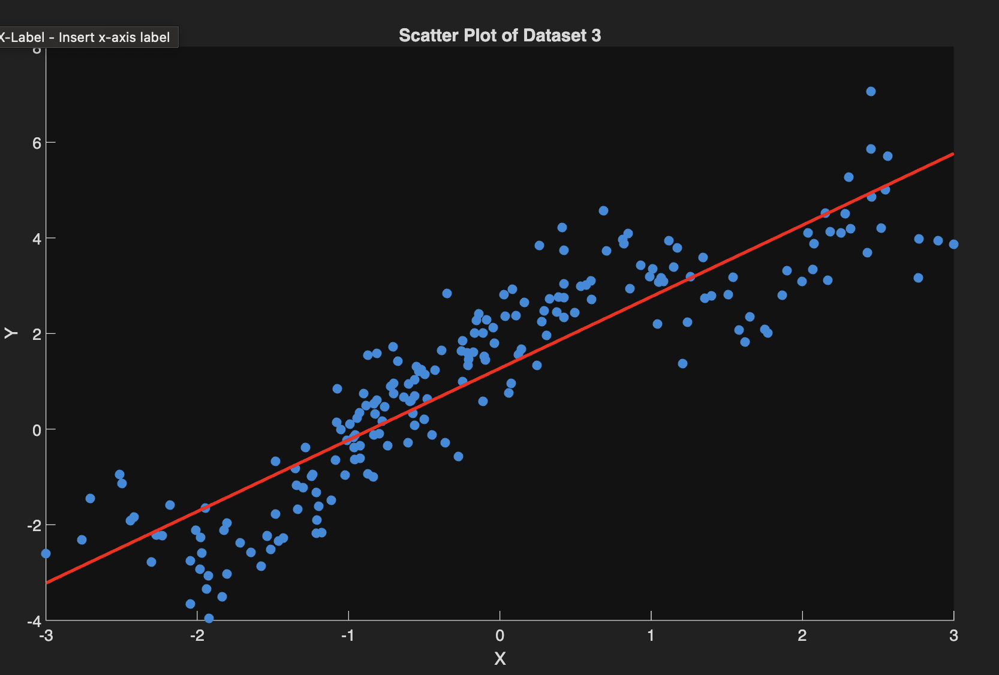
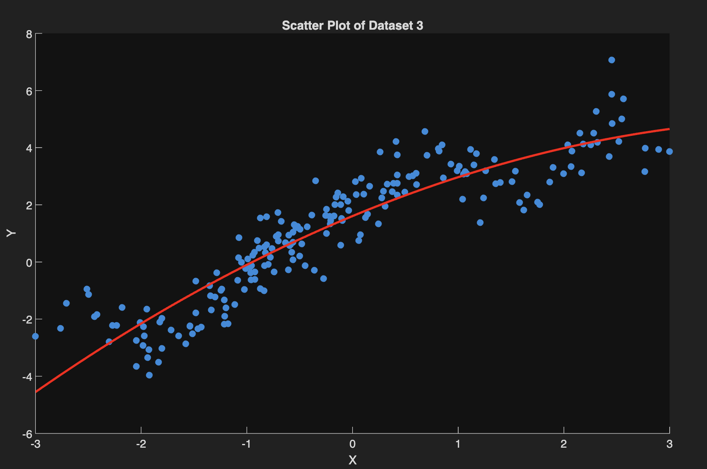
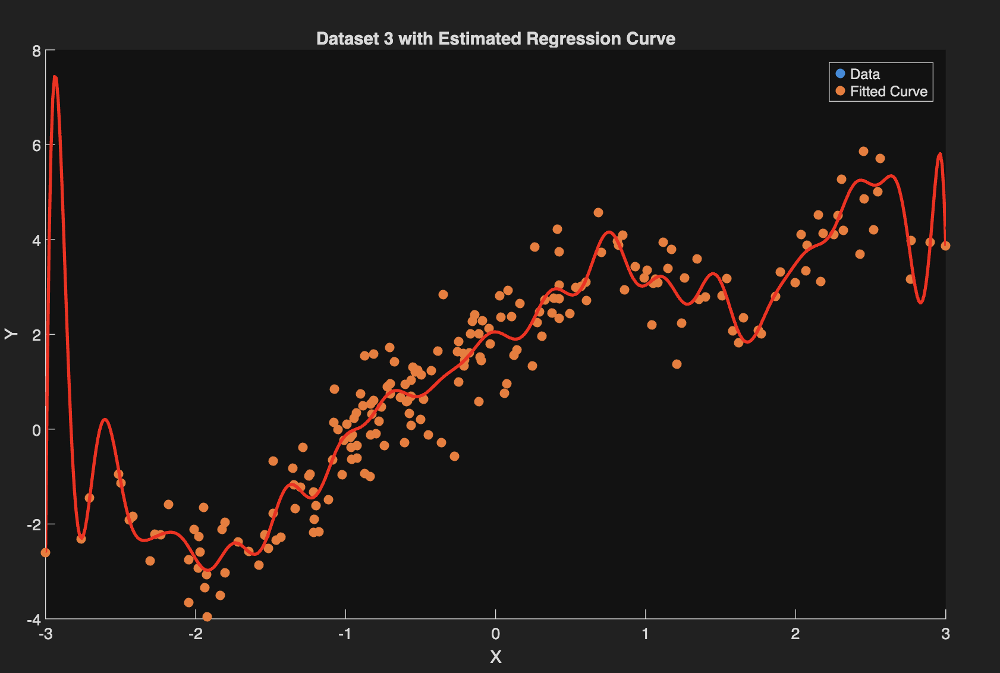

#Regression-Models-with-Normal-Homoscedastic-Errors

 
1. Simple Linear Regression with normal, homoscedastic errors:  

MATLAB CODE: 

%load dataset  
data = load('Dataset3.txt');  
n=200;  
X = data(:, 1);  
Y = data(:, 2);  

  
%code to make a simple linear regression model  
%normal, homoscedastic errors   
mdl = fitglm(X,Y,'linear','Distribution','Normal','Link','identity');  
alphaMLE = mdl.Coefficients.Estimate(1)  
betaMLE = mdl.Coefficients.Estimate(2)  
%sigma-squared  
residuals = mdl.Residuals.Raw; %errors from the fitted line  
sigma2_biased = var(residuals, 1)  % Biased MLE (divides by n)  
sigma2_unbiased = sqrt(sum((Y-(alphaMLE+betaMLE*X)).^2)/(n-numel(betaMLE)-1))  

  
%make a scatter plot of the data on the interval [-3,3]  
scatter(X, Y, 'filled');  
xlim([-3, 3]);  
xlabel('X');  
ylabel('Y');  
title('Scatter Plot of Dataset 3');  
hold on;  
%estimated regression curve  
xFit = linspace(-3, 3, 100)';  
yFit = alphaMLE + betaMLE * xFit;  
plot(xFit, yFit, 'r-', 'LineWidth', 2);    
  
  

2. Quadratic Regression Models with normal, homoscedastic errors for a dataset  

 MATLAB CODE: 

%problem 3  
%load dataset:  
data = load('Dataset3.txt');  
X = data(:, 1);  
Y = data(:, 2);  
n = length(Y);  
  
%code to make a quadratic regression model with normal, homoscedastic errors   
mdl = fitglm(X,Y,'quadratic','Distribution','Normal','Link','identity');  
alphaMLE = mdl.Coefficients.Estimate(1) %alpha  
beta1MLE = mdl.Coefficients.Estimate(2) %beta1  
beta2MLE = mdl.Coefficients.Estimate(3) %beta2  
%sigma-squared  
residuals = mdl.Residuals.Raw; %errors from the fitted line  
sigma2_biased = var(residuals, 1)  % Biased MLE (divides by n)  
  
% Unbiased estimator: divide RSS by n - p  
p = 3;  % number of coefficients in quadratic regression  
RSS = sum((Y - (alphaMLE + beta1MLE*X + beta2MLE*X.^2)).^2);  
sigma2_unbiased = RSS / (n - p)  
  
%make a scatter plot of the data on the interval [-3,3]  
scatter(X, Y, 'filled');  
xlim([-3, 3]);  
xlabel('X');  
ylabel('Y');  
title('Scatter Plot of Dataset 3');  
hold on;  

%estimated regression curve  
xFit = linspace(-3, 3, 100)';  
yFit = alphaMLE + beta1MLE*xFit + beta2MLE*(xFit).^2;  
plot(xFit, yFit, 'r-', 'LineWidth', 2);  
hold off;  

  

3. Find Maximum Likelihood Estimation and the Estimated Regression Curve:  
MATLAB CODE:  

%problem 4  
%load dataset 3  
clear;clc;  
data = load('Dataset3.txt');  
X = data(:, 1);  
Y = data(:, 2);  
n = length(X);  

% create design matrix with all 40 features  
Phi = [ones(n,1), X, X.^2];  % Start with [1, x, x^2]  

for l = 1:19  
&nbsp;    Phi = [Phi, sin(l*X), cos(l*X)];  % Add sin(ℓx) and cos(ℓx)  
end  

% compute MLE  
betaMLE = (Phi' * Phi) \ (Phi' * Y);  

% report beta_{1:3}  
beta_1_3 = betaMLE(2:4)  

% Unbiased variance estimate  
sigma2_unbiased = sum((Y - Phi*betaMLE).^2) / (n - 40)  

% Scatter plot with regression curve  
scatter(X, Y, 'filled');  
hold on;  
  
% fit the regression curve  
xFit = linspace(-3, 3, 500)';  
Phi_fit = [ones(size(xFit)), xFit, xFit.^2];  
for l = 1:19  
&nbsp;    Phi_fit = [Phi_fit, sin(l*xFit), cos(l*xFit)];  
end  
plot(xFit, Phi_fit*betaMLE, 'r-', 'LineWidth', 2);  
  
xlim([-3, 3]);  
xlabel('X'); ylabel('Y');  
title('Dataset 3 with Estimated Regression Curve');  
legend('Data', 'Fitted Curve');  
hold off;  

 
